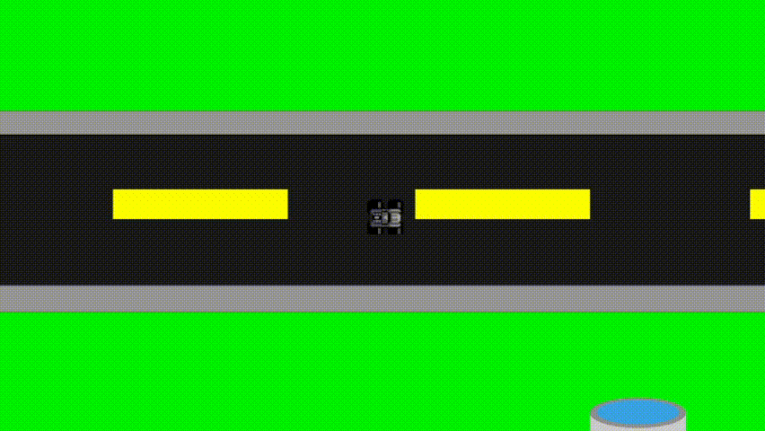

# Race car

A simple race car implemented in C++ and SFML for the sake of studying angular movement.



## Dependencies
- SFML


## How to run?
Run cmake (ensure you have it installed!):
```
cmake .
```

Build according to your platform. With make, for example:
```
make
```